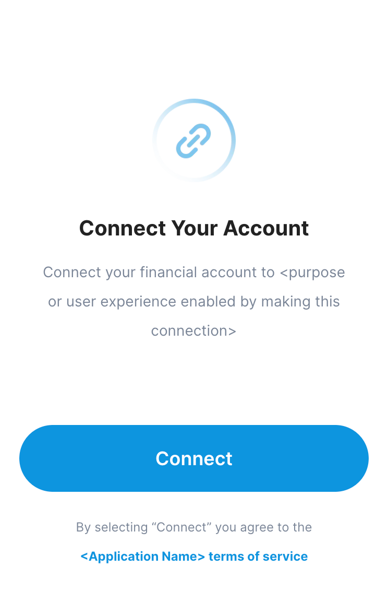
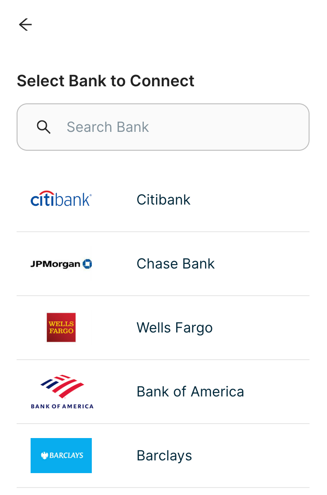
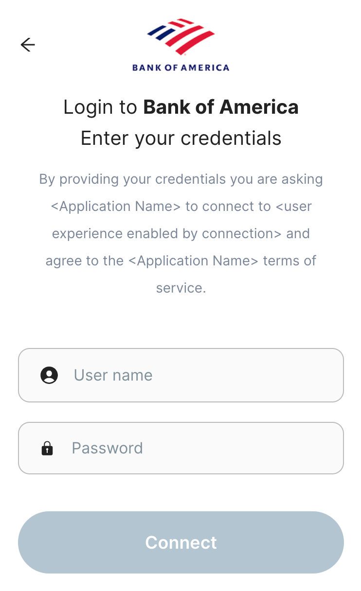
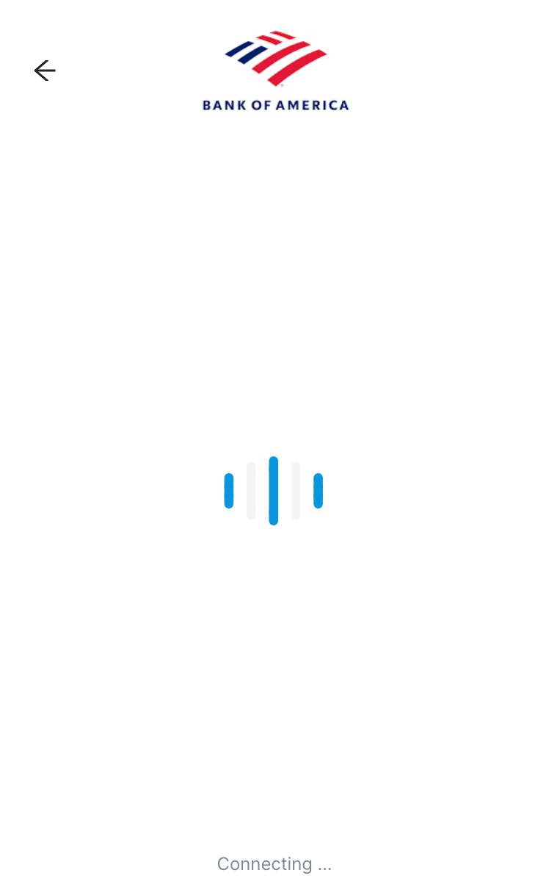
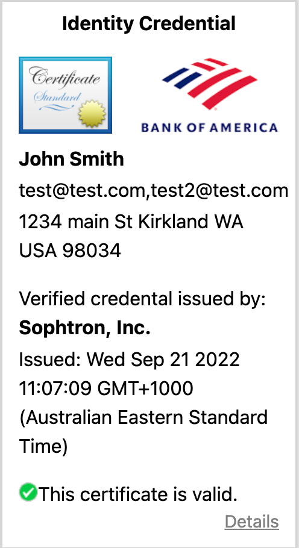
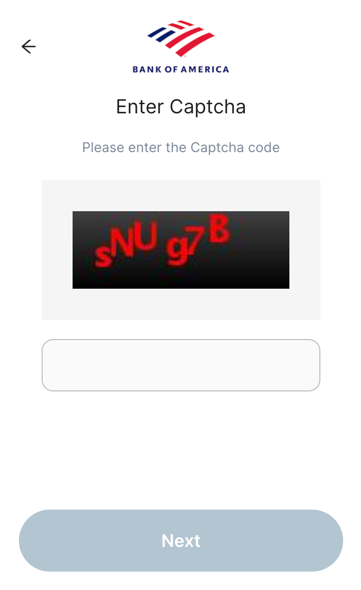
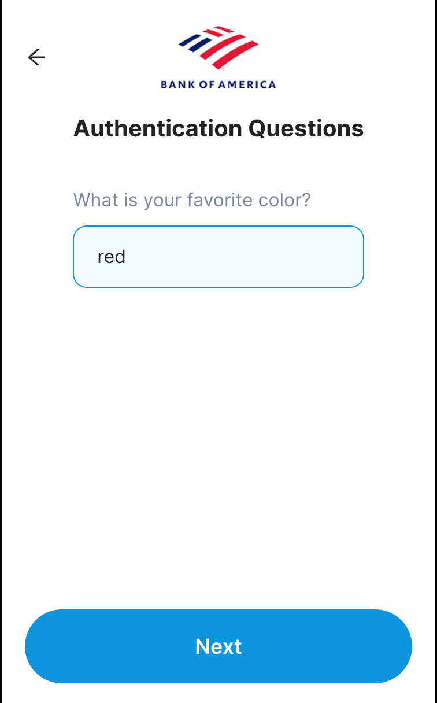
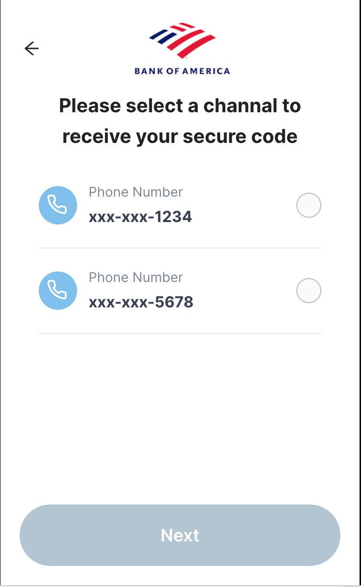
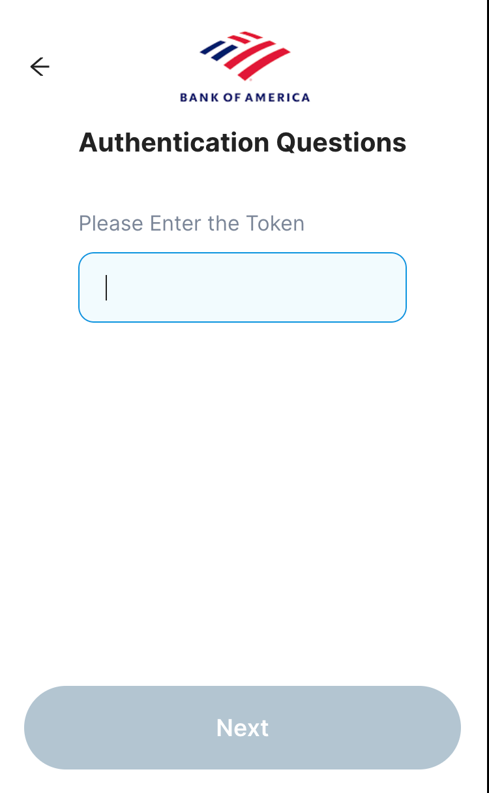

# Verifiable Credential Selector (VCS)

Developers embed the VCS into their application to allow users to select and retrieve Verifiable Credentials (VCs). 

For example a developer building an application to allow users to purchase bitcoin may want the users to obtain a VC containing KYC data or a VC containing the account number and routing number of the users bank account that will be used to pay for the bitcoin purchase.

By presenting this widget at the appropriate step in the onboarding process the user can select their bank account, provide the required credentials (including MFA) and obtain a VC that is digitally signed by the Verifiable Credential Issuers - See [Example](vc_issuer_example/README.md).

The VCS is Free Open Source Software and is part of the Block TBD Incubation Initiative.

Currently the VCS support retrieving credentials from over 40,000 banks, credit unions, brokerages and utility companies. 

  
  
  
  
  
  
  
  
  

### Data flow

#### Pre-Identity hub 

VCS sends credentials to VC Issuer.

VC Issuer returns a signed VC to the FinTech App.

#### With Identity Hub 
VCS sends credentials to VC Issuer.

VC Issuer sends a signed VC to the user's Identity Hub.

Identity Hub sends VC with the FinTech App.

## FAQ

### Q: What Verifiable Credential Issuers are currently supported?
A: At launch Sophtron.com and MX.com are supported, but developers are encouraged to add any additional providers to the VCS. This should require roughly the same amount of work as integrating an additional provider directly into your application and will eliminate the need for one off integration for future users of the VCs. In addition VCS contributors will maintain and update this code over time making this a net time saver even for the developers that perform the integration for a new
VC issuer.

### Q: What other types of VCs are supported?
A: At launch the VCs that are supported include:
- Banks
- Credit Unions
- Utility Companies
- Brokerage Accounts
- Neo Banks 
- Insurance Companies
- Cryptocurrency Exchanges

However we expect support for the following soon:
- Drivers License
- Passport
- Birth Certificate

## Project Resources

| Resource                                   | Description                                                                    |
| ------------------------------------------ | ------------------------------------------------------------------------------ |
| [CODEOWNERS](./CODEOWNERS)                 | Outlines the project lead(s)                                                   |
| [CODE_OF_CONDUCT.md](./CODE_OF_CONDUCT.md) | Expected behavior for project contributors, promoting a welcoming environment |
| [CONTRIBUTING.md](./CONTRIBUTING.md)       | Developer guide to build, test, run, access CI, chat, discuss, file issues     |
| [GOVERNANCE.md](./GOVERNANCE.md)           | Project governance                                                             |
| [LICENSE](./LICENSE)                       | Apache License, Version 2.0                                                    |
